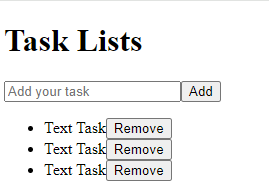
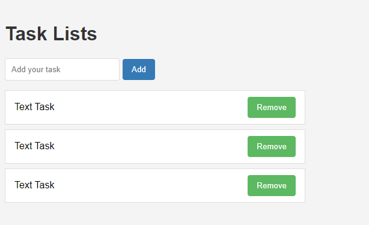

# Todo List Project

## Components Overview:

1. **Task:**
   
   The Task component is responsible for rendering individual tasks within the application. It consists of a list item containing the task text and a remove button. Each Task component represents one task item in the task list.

2. **TaskList:**
   
   TaskList is a component that manages and displays a list of tasks. It renders multiple instances of the Task component within an unordered list (ul), creating a structured representation of the task list.

3. **TaskInput:**
   
   TaskInput provides the interface for users to input new tasks into the system. It consists of a form with an input field for entering task text and a button for submitting the task. TaskInput enables users to add new tasks to the task list.

**Integration:**

The components Task, TaskList, and TaskInput are integrated into the application layout as follows:

***

## Components Style Overview:

Let's break down CSS:

1. **Body Styles:**
   - `font-family`: Sets the font for the entire document to Arial or a fallback sans-serif font.
   - `background-color`: Sets the background color of the body to a light gray (#f4f4f4).
   - `margin`: Removes default margins from the body.
   - `padding`: Adds 20 pixels of padding to all sides of the body content.

2. **h1 Styles:**
   - `color`: Sets the color of h1 headings to a dark gray (#333).

3. **ul Styles:**
   - `list-style`: Removes default list styles (bullet points).
   - `padding`: Removes default padding from unordered lists.
   - `width`: Sets the width of unordered lists to 500 pixels.

4. **li Styles:**
   - `background-color`: Sets the background color of list items to white (#fff).
   - `border`: Adds a 1 pixel solid border around list items with a light gray color (#ddd).
   - `padding`: Adds 10 pixels of padding vertically and 15 pixels horizontally to list items.
   - `margin-bottom`: Adds 8 pixels of margin at the bottom of each list item.
   - `display`: Configures list items to use flexbox layout.
   - `justify-content`: Aligns content inside list items to space evenly.
   - `align-items`: Vertically centers content inside list items.

5. **input[type="text"] Styles:**
   - `padding`: Adds 10 pixels of padding to text input fields.
   - `border`: Adds a 1 pixel solid border around text input fields with a light gray color (#ddd).
   - `border-radius`: Rounds the corners of text input fields with a 4 pixel radius.
   - `margin-right`: Adds 5 pixels of margin to the right side of text input fields.

6. **button Styles:**
   - `background-color`: Sets the background color of buttons to a green color (#5cb85c).
   - `color`: Sets the text color of buttons to white.
   - `border`: Removes default button borders.
   - `padding`: Adds 10 pixels of padding vertically and 15 pixels horizontally to buttons.
   - `border-radius`: Rounds the corners of buttons with a 4 pixel radius.
   - `cursor`: Sets the cursor to pointer, indicating that the button is clickable.

7. **button:hover Styles:**
   - Changes the background color of buttons to a darker shade of green (#449d44) when hovered over.

8. **button:active Styles:**
   - Changes the background color of buttons to an even darker shade of green (#398439) when clicked.

9. **button[type="submit"] Styles:**
   - Adjusts the background color of submit buttons to a blue color (#337ab7).

10. **button[type="submit"]:hover Styles:**
    - Changes the background color of submit buttons to a darker shade of blue (#286090) when hovered over.

11. **button[type="submit"]:active Styles:**
    - Changes the background color of submit buttons to an even darker shade of blue (#204d74) when clicked.

These styles collectively provide a cohesive and visually appealing design for the components, enhancing the user experience.

***

## Adding new tasks:

In this React application, tasks are being added through the following process:

1. **App Component (Parent Component):**
   - The `App` component serves as the parent component where task management is coordinated.
   - It initializes a state variable `tasks` using the `useState` hook to store an array of tasks.
   - The `addTask` function is defined within the `App` component. This function takes a task as an argument and adds it to the `tasks` array.
   - Inside the `addTask` function, a new task object is created with properties `id`, `text`, and `done`. The `id` is generated using `Date.now()` to ensure uniqueness.
   - The `addTask` function then updates the `tasks` state by appending the new task to the existing array using the spread operator (`...`).
   - The `TaskInput` and `TaskList` components are imported and rendered within the `App` component.
   - The `TaskInput` component is passed a callback function `onAddTask`, which is set to the `addTask` function defined in the `App` component.
   - The `TaskList` component is passed the `tasks` array as a prop.

2. **TaskInput Component:**
   - The `TaskInput` component is responsible for allowing users to input new tasks.
   - It initializes a state variable `input` using the `useState` hook to store the value of the input field.
   - When the form is submitted (`onSubmit` event), the `handleSubmit` function is called.
   - In the `handleSubmit` function, the input value is trimmed to remove any leading or trailing whitespace. If the trimmed input is not empty, the `onAddTask` callback function (received as a prop) is called with the input value as an argument.
   - After adding the task, the `input` state is reset to an empty string, clearing the input field.

3. **TaskList Component:**
   - The `TaskList` component is responsible for displaying the list of tasks.
   - It receives the `tasks` array as a prop.
   - Inside the component, it maps over the `tasks` array and renders a `Task` component for each task in the array.
   - Each `Task` component is passed a `key` prop with the task's `id` for efficient rendering and a `task` prop containing the task object.

4. **Task Component:**
   - The `Task` component is responsible for rendering individual task items.
   - It receives a `task` object as a prop, containing properties like `text`, `id`, and `done`.
   - Inside the component, it displays the task text using `{task.text}` within a `span` element.
   - Additionally, it includes a "Remove" button, which can be used to delete the task item (though the functionality for removing tasks is not implemented in the provided code).

In summary, tasks are added to the application by inputting task text in the `TaskInput` component, which triggers the `addTask` function in the `App` component. The new task is then added to the `tasks` state array and displayed in the `TaskList` component.

***

## Removing tasks:

In this React application, tasks are being deleted through the following process:

1. **App Component (Parent Component):**
   - The `App` component is the parent component where task management is coordinated.
   - It initializes a state variable `tasks` using the `useState` hook to store an array of tasks.
   - The `addTask` function is defined within the `App` component, responsible for adding tasks to the `tasks` array.
   - The `deleteTask` function is also defined within the `App` component, responsible for deleting tasks from the `tasks` array.
   - Both `addTask` and `deleteTask` functions are passed down to the child components as props.

2. **TaskList Component:**
   - The `TaskList` component receives the `tasks` array and `onDeleteTask` function as props.
   - Inside the component, it maps over the `tasks` array and renders a `Task` component for each task.
   - Each `Task` component is passed a `key` prop with the task's `id` for efficient rendering and a `task` prop containing the task object.
   - Additionally, the `onDeleteTask` function is passed down to each `Task` component.

3. **Task Component:**
   - The `Task` component is responsible for rendering individual task items.
   - It receives a `task` object as a prop, containing properties like `text`, `id`, and `done`.
   - The `onDelete` function is received as a prop, which is triggered when the "Remove" button is clicked.
   - When the "Remove" button is clicked, the `onDelete` function is called, which in turn calls the `deleteTask` function defined in the `App` component with the `taskId` as an argument.

4. **Deleting Task:**
   - When the "Remove" button in the `Task` component is clicked, it triggers the `onDelete` function passed down from the `TaskList`.
   - The `onDelete` function then calls the `deleteTask` function in the `App` component, passing the `taskId` of the task to be deleted.
   - Inside the `deleteTask` function, the `tasks` state is updated by filtering out the task with the matching `taskId`.
   - The filtered `tasks` array is then set as the new state, effectively removing the task from the list.

In summary, tasks are deleted from the application by clicking the "Remove" button in the `Task` component, which triggers the `onDelete` function and subsequently the `deleteTask` function in the `App` component. The task is then filtered out from the `tasks` array, and the updated array is set as the new state, reflecting the deletion in the UI.

***