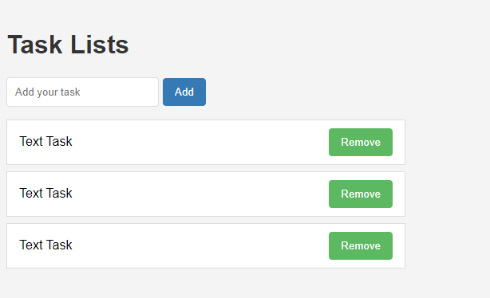

# Projeto Lista de Tarefas

## Visão Geral dos Componentes:

1. **Tarefa:**
   
   O componente Tarefa é responsável por renderizar tarefas individuais dentro da aplicação. Ele consiste em um item de lista contendo o texto da tarefa e um botão de remoção. Cada componente Tarefa representa um item de tarefa na lista de tarefas.

2. **Lista de Tarefas:**
   
   Lista de Tarefas é um componente que gerencia e exibe uma lista de tarefas. Ele renderiza várias instâncias do componente Tarefa dentro de uma lista não ordenada (ul), criando uma representação estruturada da lista de tarefas.

3. **Entrada de Tarefa:**
   
   Entrada de Tarefa fornece a interface para os usuários inserirem novas tarefas no sistema. Ela consiste em um formulário com um campo de entrada para inserir o texto da tarefa e um botão para enviar a tarefa. Entrada de Tarefa permite que os usuários adicionem novas tarefas à lista de tarefas.

**Integração:**

Os componentes Tarefa, Lista de Tarefas e Entrada de Tarefa são integrados ao layout da aplicação da seguinte maneira:

***

## Visão Geral dos Estilos dos Componentes:

Vamos analisar o CSS:

1. **Estilos do Corpo (Body):**
   - `font-family`: Define a fonte para todo o documento como Arial ou uma fonte sans-serif alternativa.
   - `background-color`: Define a cor de fundo do corpo como um cinza claro (#f4f4f4).
   - `margin`: Remove margens padrão do corpo.
   - `padding`: Adiciona 20 pixels de preenchimento a todos os lados do conteúdo do corpo.

2. **Estilos de h1:**
   - `color`: Define a cor dos títulos h1 como um cinza escuro (#333).

3. **Estilos de ul:**
   - `list-style`: Remove estilos de lista padrão (pontos de marcação).
   - `padding`: Remove o preenchimento padrão das listas não ordenadas.
   - `width`: Define a largura das listas não ordenadas como 500 pixels.

4. **Estilos de li:**
   - `background-color`: Define a cor de fundo dos itens de lista como branco (#fff).
   - `border`: Adiciona uma borda sólida de 1 pixel ao redor dos itens de lista com uma cor cinza claro (#ddd).
   - `padding`: Adiciona 10 pixels de preenchimento vertical e 15 pixels de preenchimento horizontal aos itens de lista.
   - `margin-bottom`: Adiciona 8 pixels de margem na parte inferior de cada item de lista.
   - `display`: Configura os itens de lista para usar layout flexbox.
   - `justify-content`: Alinha o conteúdo dentro dos itens de lista para espaçar uniformemente.
   - `align-items`: Centraliza verticalmente o conteúdo dentro dos itens de lista.

5. **Estilos de input[type="text"]:**
   - `padding`: Adiciona 10 pixels de preenchimento aos campos de entrada de texto.
   - `border`: Adiciona uma borda sólida de 1 pixel ao redor dos campos de entrada de texto com uma cor cinza claro (#ddd).
   - `border-radius`: Arredonda os cantos dos campos de entrada de texto com um raio de 4 pixels.
   - `margin-right`: Adiciona 5 pixels de margem à direita dos campos de entrada de texto.

6. **Estilos de botão (button):**
   - `background-color`: Define a cor de fundo dos botões como uma cor verde (#5cb85c).
   - `color`: Define a cor do texto dos botões como branca.
   - `border`: Remove as bordas padrão dos botões.
   - `padding`: Adiciona 10 pixels de preenchimento vertical e 15 pixels de preenchimento horizontal aos botões.
   - `border-radius`: Arredonda os cantos dos botões com um raio de 4 pixels.
   - `cursor`: Define o cursor como apontador, indicando que o botão é clicável.

7. **Estilos de botão:hover:**
   - Altera a cor de fundo dos botões para uma tonalidade mais escura de verde (#449d44) ao passar o mouse sobre eles.

8. **Estilos de botão:active:**
   - Altera a cor de fundo dos botões para uma tonalidade ainda mais escura de verde (#398439) quando clicados.

9. **Estilos de botão[type="submit"]:**
   - Ajusta a cor de fundo dos botões de envio para uma cor azul (#337ab7).

10. **Estilos de botão[type="submit"]:hover:**
    - Altera a cor de fundo dos botões de envio para uma tonalidade mais escura de azul (#286090) ao passar o mouse sobre eles.

11. **Estilos de botão[type="submit"]:active:**
    - Altera a cor de fundo dos botões de envio para uma tonalidade ainda mais escura de azul (#204d74) quando clicados.

Esses estilos fornecem de forma coesa e visualmente agradável o design dos componentes, aprimorando a experiência do usuário.

***

## Adicionando novas tarefas:

Nesta aplicação React, as tarefas são adicionadas por meio do seguinte processo:

1. **Componente App (Componente Pai):**
   - O componente `App` atua como o componente pai onde o gerenciamento de tarefas é coordenado.
   - Ele inicializa uma variável de estado `tasks` usando o hook `useState` para armazenar um array de tarefas.
   - A função `addTask` é definida dentro do componente `App`. Esta função recebe uma tarefa como argumento e a adiciona ao array `tasks`.
   - Dentro da função `addTask`, um novo objeto de tarefa é criado com propriedades `id`, `text` e `done`. O `id` é gerado usando `Date.now()` para garantir a unicidade.
   - A função `addTask` então atualiza o estado `tasks` adicionando a nova tarefa ao array existente usando o operador spread (`...`).
   - Os componentes `TaskInput` e `TaskList` são importados e renderizados dentro do componente `App`.
   - O componente `TaskInput` recebe uma função de retorno de chamada `onAddTask`, que é definida como a função `addTask` dentro do componente `App`.
   - O componente `TaskList` recebe o array `tasks` como uma propriedade.

2. **Componente Entrada de Tarefa (TaskInput):**
   - O componente `TaskInput` é responsável por permitir que os usuários insiram novas tarefas.
   - Ele inicializa uma variável de estado `input` usando o hook `useState` para armazenar o valor do campo de entrada.
   - Quando o formulário é enviado (evento `onSubmit`), a função `handleSubmit` é chamada.
   - Na função `handleSubmit`, o valor de entrada é aparado para remover qualquer espaço em branco à frente ou atrás. Se a entrada aparada não estiver vazia, a função de retorno de chamada `onAddTask` é chamada com o valor de entrada como argumento.
   - Após adicionar a tarefa, o estado `input` é redefinido para uma string vazia, limpando o campo de entrada.

3. **Componente Lista de Tarefas (TaskList):**
   - O componente `TaskList` é responsável por exibir a lista de tarefas.
   - Ele recebe o array `tasks` como uma propriedade.
   - Dentro do componente, ele mapeia o array `tasks` e renderiza um componente `Task` para cada tarefa no array.
   - Cada componente `Task` recebe uma propriedade `key` com o `id` da tarefa para renderização eficiente e uma propriedade `task` contendo o objeto da tarefa.

4. **Componente Tarefa (Task):**
   - O componente `Task` é responsável por renderizar itens de tarefa individuais.
   - Ele recebe um objeto de `task` como uma propriedade, contendo propriedades como `text`, `id` e `done`.
   - Dentro do componente, ele exibe o texto da tarefa usando `{task.text}` dentro de um elemento `span`.
   - Além disso, inclui um botão "Remover", que pode ser usado para excluir o item de tarefa (embora a funcionalidade para remover tarefas não esteja implementada no código fornecido).

Em resumo, as tarefas são adicionadas à aplicação inserindo o texto da tarefa no componente `TaskInput`, o que aciona a função `addTask` no componente `App`. A nova tarefa é então adicionada ao array `tasks` e exibida no componente `TaskList`.

***

## Removendo tarefas:

Nesta aplicação React, as tarefas são removidas através do seguinte processo:

1. **Componente App (Componente Pai):**
   - O componente `App` é o componente pai onde o gerenciamento de tarefas é coordenado.
   - Ele inicializa uma variável de estado `tasks` usando o hook `useState` para armazenar um array de tarefas.
   - A função `addTask` é definida dentro do componente `App`, responsável por adicionar tarefas ao array `tasks`.
   - A função `deleteTask` também é definida dentro do componente `App`, responsável por excluir tarefas do array `tasks`.
   - Tanto as funções `addTask` quanto `deleteTask` são passadas para os componentes filhos como props.

2. **Componente Lista de Tarefas (TaskList):**
   - O componente `TaskList` recebe o array `tasks` e a função `onDeleteTask` como props.
   - Dentro do componente, ele mapeia o array `tasks` e renderiza um componente `Task` para cada tarefa.
   - Cada componente `Task` recebe uma propriedade `key` com o `id` da tarefa para renderização eficiente, e uma propriedade `task`, contendo o objeto da tarefa.
   - Além disso, a função `onDeleteTask` é passada para cada componente `Task`.

3. **Componente Tarefa (Task):**
   - O componente `Task` é responsável por renderizar itens de tarefa individuais.
   - Ele recebe um objeto de `task` como uma propriedade, contendo propriedades como `text`, `id` e `done`.
   - Quando o texto da tarefa (``) é clicado, a função `onToggleTask` é acionada.
   - A função `onToggleTask` alterna a propriedade `done` da tarefa chamando a função `toggleTaskDone` definida no componente `App`, passando o `id` da tarefa.
   - Além disso, o botão "Remover" é renderizado para excluir tarefas e, quando clicado, ele aciona a função `onDelete` passada pelo `TaskList`.

4. **Excluindo Tarefa:**
   - Quando o botão "Remover" no componente `Task` é clicado, ele aciona a função `onDelete` e, consequentemente, a função `deleteTask` no componente `App`, passando o `id` da tarefa a ser excluída.
   - Dentro da função `deleteTask`, o estado `tasks` é atualizado filtrando a tarefa com o `id` correspondente.
   - O array `tasks` filtrado é então definido como o novo estado, removendo efetivamente a tarefa da lista.

Em resumo, as tarefas são excluídas da aplicação clicando no botão "Remover" no componente `Task`, o que aciona a função `onDelete` e subsequentemente a função `deleteTask` no componente `App`. A tarefa é então filtrada do array `tasks`, e o array atualizado é definido como o novo estado, refletindo a exclusão na interface do usuário.

***

## Alternar tarefas:

Nesta aplicação React, a funcionalidade "alternar tarefa" permite aos usuários marcar tarefas como concluídas ou não concluídas clicando no texto da tarefa. Veja como funciona:

1. **Componente App (Componente Pai):**
   - A função `toggleTaskDone` é definida dentro do componente `App`. Ela recebe um `taskId` como argumento.
   - Dentro da função, a função `setTasks` é chamada com o resultado da iteração sobre o array `tasks`. Para cada tarefa, se o `id` da tarefa corresponder ao `taskId` fornecido, sua propriedade `done` é alternada (alternando entre `true` e `false`). Caso contrário, a tarefa permanece inalterada.
   - O array de tarefas atualizado é então definido como o novo estado usando `setTasks`.

2. **Componente Lista de Tarefas (TaskList):**
   - O componente `TaskList` recebe o array `tasks`, `onDeleteTask` e `onToggleTask` como funções props.
   - Dentro do componente, ele itera sobre o array `tasks` e renderiza um componente `Task` para cada tarefa.
   - Cada componente `Task` recebe uma propriedade `key` com o `id` da tarefa para renderização eficiente, e props `task`, `onDelete` e `onToggleTask` contendo o objeto da tarefa e as funções de callback para excluir e alternar tarefas, respectivamente.

3. **Componente Tarefa (Task):**
   - O componente `Task` é responsável por renderizar itens de tarefa individuais.
   - Ele recebe um objeto de `task` como uma propriedade, contendo propriedades como `text`, `id` e `done`.
   - Quando o texto da tarefa (``) é clicado, a função `onToggleTask` é acionada.
   - A função `onToggleTask` alterna a propriedade `done` da tarefa chamando a função `toggleTaskDone` definida no componente `App`, passando o `id` da tarefa.
   - Além disso, o botão "Remover" é renderizado para excluir tarefas e, quando clicado, ele aciona a função `onDelete` passada pelo `TaskList`.

4. **Feedback Visual:**
   - Quando uma tarefa é marcada como concluída (`done` é `true`), seu texto é indicado visualmente com um estilo de linha através. Isso é alcançado configurando dinamicamente a propriedade `textDecoration` CSS inline com base no status `done` da tarefa.

Em resumo, a funcionalidade "alternar tarefa" permite aos usuários marcar tarefas como concluídas ou não concluídas clicando no texto da tarefa. Quando clicado, a função `toggleTaskDone` é chamada para alternar a propriedade `done` da tarefa, e a interface do usuário é atualizada para refletir a alteração no status da tarefa.

***

## Salvando dados no LocalStorage:

Nesta aplicação React, os dados estão sendo salvos usando `localStorage` no hook `useEffect`. Veja como funciona:

1. **Recuperando Dados do LocalStorage:**
   - Quando o componente `App` é montado, ele inicializa a variável de estado `tasks` usando `useState`.
   - O valor inicial de `tasks` é definido como o resultado de `JSON.parse(localStorage.getItem("tasks")) || []`.
   - Isso recupera as tarefas armazenadas do armazenamento local usando `localStorage.getItem("tasks")`. Se não houver tarefas armazenadas (ou se for a primeira vez que a aplicação é executada), ele recua para um array vazio (`[]`).

2. **Salvando Dados no LocalStorage:**
   - O hook `useEffect` é usado para salvar o estado `tasks` no armazenamento local sempre que ele mudar.
   - Ele recebe uma função de retorno de chamada como seu primeiro argumento, que é executada após cada renderização se o array de dependências (segundo argumento) mudar.
   - Dentro da função de retorno de chamada, `localStorage.setItem("tasks", JSON.stringify(tasks))` é chamado.
   - Isso converte o array `tasks` em uma string JSON usando `JSON.stringify()` e o salva no armazenamento local sob a chave "tasks".

3. **Atualizando Dados:**
   - Sempre que o estado `tasks` muda (devido à adição, exclusão

 ou alternância de tarefas), o hook `useEffect` é acionado.
   - Isso faz com que a função de retorno de chamada dentro do hook `useEffect` seja executada, salvando o array de `tasks` atualizado no armazenamento local.

4. **Funções de Gerenciamento de Tarefas:**
   - As funções `addTask`, `deleteTask` e `toggleTaskDone` são responsáveis por adicionar, excluir e alternar tarefas, respectivamente.
   - Essas funções atualizam o estado `tasks` usando `setTasks`, o que aciona o hook `useEffect`, salvando assim as tarefas atualizadas no armazenamento local.

5. **Renderização de Componentes:**
   - O componente `App` renderiza os componentes `TaskInput` e `TaskList`, passando o estado `tasks` e as funções de gerenciamento de tarefas como props.

Em resumo, a aplicação utiliza `localStorage` para persistir os dados das tarefas entre recarregamentos da página. As tarefas são inicialmente recuperadas do armazenamento local quando o componente é montado, e elas são salvas no armazenamento local sempre que são adicionadas, excluídas ou alternadas. Isso garante que os dados das tarefas permaneçam consistentes mesmo depois que o usuário atualiza a página ou fecha o navegador.